# DaTEC - Dataset Sharing Platform

## Table of Contents

1. [Executive Summary](#1-executive-summary)
2. [Database Selection and Justification](#2-database-selection-and-justification)
3. [Multi-Node Container Architecture](#3-multi-node-container-architecture)
4. [Database Modeling](#4-database-modeling)
5. [Cross-Database Integration](#5-cross-database-integration)
6. [API Overview](#6-api-overview)
7. [Installation Guide](#7-installation-guide)

## 1. Executive Summary

DaTEC is a dataset sharing platform implementing a **polyglot persistence architecture** with four specialized databases working cohesively. The system supports 21 user stories covering authentication, dataset management, social features, commenting, voting, and administrative controls.

### 1.1 Technology Stack

| Layer            | Technology                             | Version            |
| ---------------- | -------------------------------------- | ------------------ |
| Backend          | Node.js / Express.js                   | v22.20.0 / ^4.18.2 |
| Frontend         | Vue.js / Vite                          | ^3.3.4 / ^4.5.0    |
| Primary Database | MongoDB (Containerized, Replica Set)   | 8.0                |
| Cache & Counters | Redis (Containerized, Primary-Replica) | 8-alpine           |
| Graph Database   | Neo4j Desktop (Local)                  | 2.0.4              |
| File Storage     | CouchDB (Local)                        | 3.5.0              |

### 1.2 System Architecture Overview

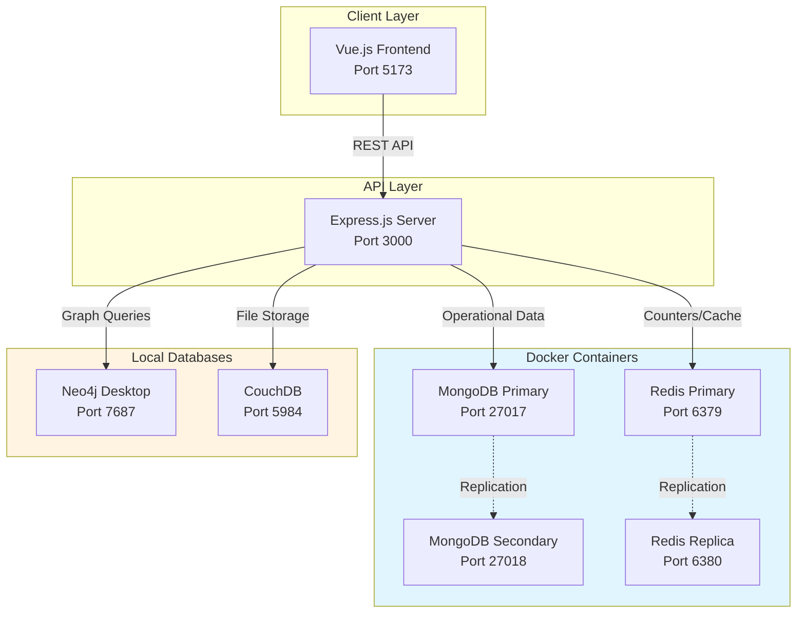

## 2. Database Selection and Justification

### 2.1 Selection Criteria

Each database was selected based on specific requirements and optimal use cases:

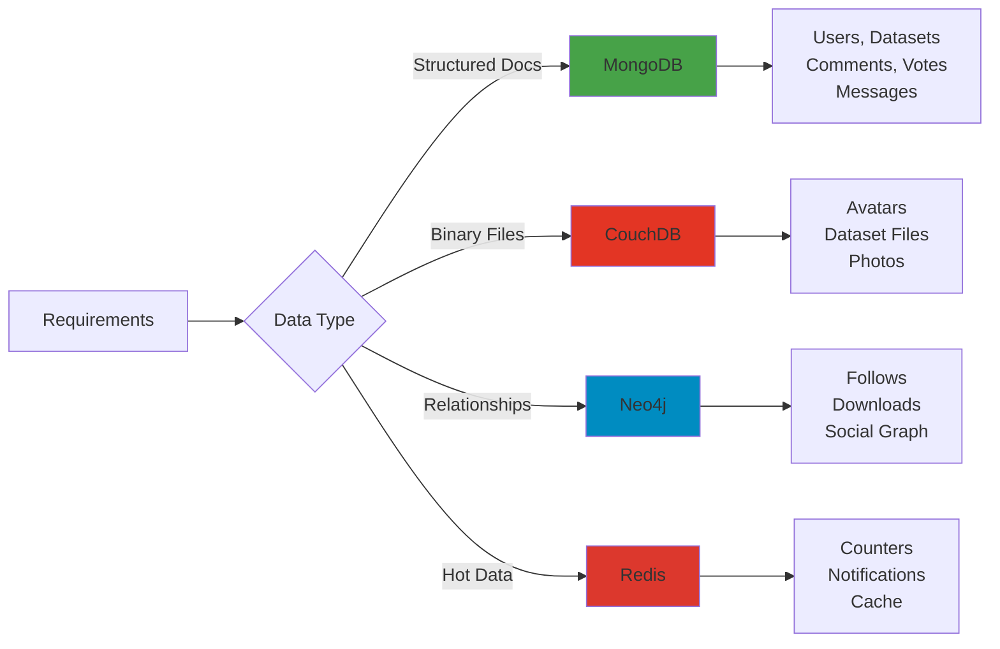

### 2.2 Comparative Analysis

| Requirement             | Alternative A    | Alternative B | Selected | Justification                                                                           |
| ----------------------- | ---------------- | ------------- | -------- | --------------------------------------------------------------------------------------- |
| **Document Storage**    | PostgreSQL JSONB | **MongoDB**   | MongoDB  | Native document model, replica sets, aggregation framework, text search                 |
| **File Storage**        | MongoDB GridFS   | **CouchDB**   | CouchDB  | No chunking (GridFS splits into 255KB), native HTTP streaming, simpler attachment model |
| **Graph Relationships** | ArangoDB         | **Neo4j**     | Neo4j    | Mature Cypher query language, constant-time traversals, better tooling ecosystem        |
| **Caching & Counters**  | Memcached        | **Redis**     | Redis    | Richer data structures (Lists, Hashes), atomic operations, persistence options          |

### 2.3 Database Distribution Strategy

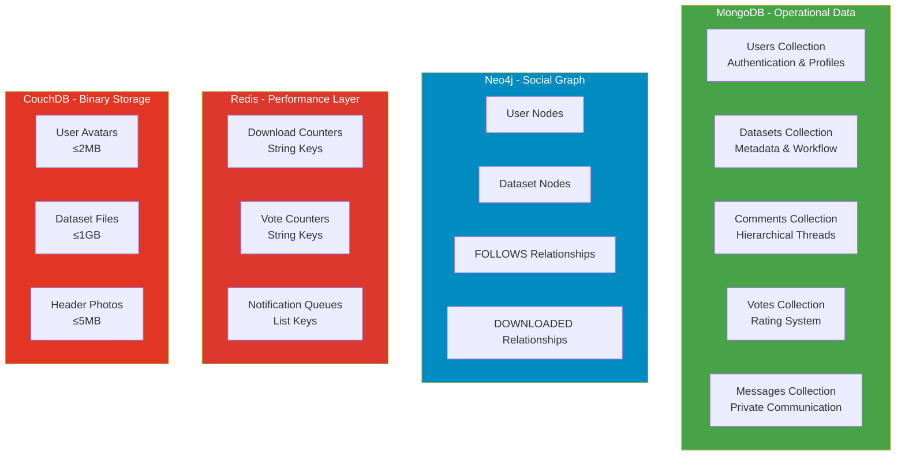

## 3. Multi-Node Container Architecture

### 3.1 MongoDB Replica Set Configuration

**Architecture:** Primary-Secondary replica set (`datecRS`)

**Justification for Multi-Node:**

1. **High Availability:** Automatic failover if primary fails
2. **Data Redundancy:** Full dataset replication on secondary
3. **Read Scaling:** Distribute read operations
4. **Zero-Downtime Maintenance:** Rolling upgrades without service interruption

**Container Configuration:**

```yaml
# MongoDB Primary Node
mongo-primary:
  image: mongo:8.0
  container_name: datec-mongo-primary
  hostname: mongo-primary
  ports:
    - "27017:27017"
  command: >
    mongod --replSet datecRS 
      --bind_ip_all 
      --wiredTigerCacheSizeGB 0.5
  volumes:
    - mongo_primary_data:/data/db
  deploy:
    resources:
      limits:
        memory: 1.2G
      reservations:
        memory: 256M

# MongoDB Secondary Node
mongo-secondary:
  image: mongo:8.0
  container_name: datec-mongo-secondary
  hostname: mongo-secondary
  ports:
    - "27018:27017"
  command: >
    mongod --replSet datecRS 
      --bind_ip_all 
      --wiredTigerCacheSizeGB 0.3
  deploy:
    resources:
      limits:
        memory: 800M
```

**Initialization Process (setup-mongo.js):**

```javascript
// Replica set initialization
rs.initiate({
  _id: "datecRS",
  members: [
    { _id: 0, host: "mongo-primary:27017", priority: 2 }, // Preferred primary
    { _id: 1, host: "mongo-secondary:27017", priority: 1 },
  ],
});

// Wait for replica set to stabilize
while (!rs.status().ok) {
  sleep(1000);
}
```

### 3.2 Redis Primary-Replica Configuration

**Architecture:** Master-Slave replication

**Justification for Multi-Node:**

1. **Read Scaling:** Offload read operations to replica
2. **Data Safety:** Persistence through RDB + AOF
3. **Failover Ready:** Replica can be promoted to primary
4. **Performance:** Sub-millisecond operations maintained

**Container Configuration:**

```yaml
# Redis Primary Node
redis-primary:
  image: redis:8-alpine
  container_name: datec-redis-primary
  hostname: redis-primary
  ports:
    - "6379:6379"
  command: >
    redis-server 
    --maxmemory 400mb 
    --maxmemory-policy allkeys-lru 
    --save 60 1000
    --appendonly yes
    --appendfsync everysec
  deploy:
    resources:
      limits:
        memory: 512M

# Redis Replica Node
redis-replica:
  image: redis:8-alpine
  container_name: datec-redis-replica
  hostname: redis-replica
  ports:
    - "6380:6379"
  command: >
    redis-server 
    --replicaof redis-primary 6379
    --maxmemory 200mb 
    --replica-read-only yes
  deploy:
    resources:
      limits:
        memory: 256M
```

**Persistence Strategy:**

- **RDB Snapshots:** Every 60 seconds if 1000+ keys changed
- **AOF Log:** Append-only file with `everysec` fsync
- **Replication:** Asynchronous with automatic reconnection

### 3.3 Resource Allocation Summary

| Database          | Container Type | Memory Limit    | Storage           | Purpose                      |
| ----------------- | -------------- | --------------- | ----------------- | ---------------------------- |
| MongoDB Primary   | Docker         | 1.2 GB          | ~2 GB             | All writes + reads           |
| MongoDB Secondary | Docker         | 800 MB          | ~2 GB             | Replication + optional reads |
| Redis Primary     | Docker         | 512 MB          | ~100 MB           | All writes                   |
| Redis Replica     | Docker         | 256 MB          | ~100 MB           | Read scaling                 |
| Neo4j             | Local          | ~1 GB           | ~500 MB           | Graph operations             |
| CouchDB           | Local          | ~256 MB         | 2-10 GB           | File storage                 |
| **Total**         | -              | **~3.8 GB RAM** | **~7-15 GB Disk** | -                            |

## 4. Database Modeling

### 4.1 MongoDB - Document Models

#### 4.1.1 Users Collection

**Purpose:** Stores user accounts, authentication credentials, and profile information

**Schema Definition (setup-mongo.js):**

```javascript
db.createCollection("users", {
  validator: {
    $jsonSchema: {
      bsonType: "object",
      required: [
        "user_id",
        "username",
        "email_address",
        "password_hash",
        "full_name",
        "birth_date",
        "is_admin",
        "created_at",
      ],
      properties: {
        user_id: {
          bsonType: "string",
          description: "UUID v5 - Primary Key, must be unique",
        },
        username: {
          bsonType: "string",
          minLength: 3,
          maxLength: 30,
          pattern: "^[a-zA-Z0-9_]+$",
          description: "Alphanumeric + underscore only",
        },
        email_address: {
          bsonType: "string",
          pattern: "^[a-zA-Z0-9._%+-]+@[a-zA-Z0-9.-]+\\.[a-zA-Z]{2,}$",
          description: "Valid email format required",
        },
        password_hash: {
          bsonType: "string",
          description: "Bcrypt hash (12 rounds) - never store plain text",
        },
        full_name: {
          bsonType: "string",
          minLength: 1,
          maxLength: 100,
        },
        birth_date: {
          bsonType: "date",
          description: "User must be 15+ years old (validated in controller)",
        },
        avatar_ref: {
          bsonType: ["object", "null"],
          properties: {
            couchdb_document_id: { bsonType: "string" },
            file_name: { bsonType: "string" },
            file_size_bytes: { bsonType: "int" },
            mime_type: { bsonType: "string" },
          },
          description: "Reference to CouchDB avatar document",
        },
        is_admin: {
          bsonType: "bool",
          description: "Authorization flag - default false",
        },
        created_at: { bsonType: "date" },
        updated_at: { bsonType: "date" },
      },
    },
  },
});
```

**Indexes:**

```javascript
// Unique indexes for authentication
db.users.createIndex({ user_id: 1 }, { unique: true, name: "user_id_unique" });
db.users.createIndex(
  { username: 1 },
  { unique: true, name: "username_unique" }
);
db.users.createIndex(
  { email_address: 1 },
  { unique: true, name: "email_unique" }
);

// Text search for user discovery (HU14)
db.users.createIndex(
  { username: "text", full_name: "text" },
  { name: "user_search_text" }
);
```

**Field Constraints:**

| Field         | Type        | Constraints                      | Validation Location                                              |
| ------------- | ----------- | -------------------------------- | ---------------------------------------------------------------- |
| user_id       | String      | UUID v5 format                   | Generated in `utils/id-generators.js`                            |
| username      | String      | 3-30 chars, ^[a-zA-Z0-9_]+$      | MongoDB validator + Joi in controller                            |
| email_address | String      | Valid email format               | MongoDB validator + Joi                                          |
| password_hash | String      | Bcrypt hash                      | Generated in `auth.controller.js` with bcrypt.hash(password, 12) |
| birth_date    | Date        | Age ≥ 15 years                   | Calculated in `auth.controller.js`                               |
| avatar_ref    | Object/Null | Must reference valid CouchDB doc | Set in `couchdb-manager.js` after upload                         |
| is_admin      | Boolean     | Default: false                   | Set explicitly or via HU3                                        |

#### 4.1.2 Datasets Collection

**Purpose:** Stores dataset metadata, workflow state, and file references

**Schema Definition:**

```javascript
db.createCollection("datasets", {
  validator: {
    $jsonSchema: {
      bsonType: "object",
      required: [
        "dataset_id",
        "owner_user_id",
        "dataset_name",
        "description",
        "file_references",
        "status",
        "is_public",
        "created_at",
      ],
      properties: {
        dataset_id: {
          bsonType: "string",
          pattern: "^[a-z0-9_]+_[0-9]{8}_[0-9]{3}$",
          description: "Format: {username}_{YYYYMMDD}_{sequence}",
        },
        owner_user_id: {
          bsonType: "string",
          description: "Foreign key to users.user_id",
        },
        parent_dataset_id: {
          bsonType: ["string", "null"],
          description: "References original dataset_id if cloned (HU18)",
        },
        dataset_name: {
          bsonType: "string",
          minLength: 3,
          maxLength: 100,
          description: "Display name for dataset",
        },
        description: {
          bsonType: "string",
          minLength: 10,
          maxLength: 5000,
          description: "Detailed description for discovery",
        },
        tags: {
          bsonType: "array",
          items: { bsonType: "string" },
          description: "Array of tags for search optimization",
        },
        file_references: {
          bsonType: "array",
          minItems: 1,
          items: {
            bsonType: "object",
            required: [
              "couchdb_document_id",
              "file_name",
              "file_size_bytes",
              "mime_type",
            ],
            properties: {
              couchdb_document_id: { bsonType: "string" },
              file_name: { bsonType: "string" },
              file_size_bytes: { bsonType: "long" },
              mime_type: { bsonType: "string" },
            },
          },
          description: "References to CouchDB file documents",
        },
        header_photo_ref: {
          bsonType: ["object", "null"],
          description: "Reference to CouchDB header photo (required for HU5)",
        },
        tutorial_video_ref: {
          bsonType: ["string", "null"],
          pattern: "^https?://",
          description: "URL to tutorial video (HU11)",
        },
        status: {
          enum: ["pending", "approved", "rejected"],
          description: "Workflow state for admin approval (HU6, HU8)",
        },
        reviewed_at: { bsonType: ["date", "null"] },
        reviewed_by: {
          bsonType: ["string", "null"],
          description: "Admin user_id who reviewed",
        },
        is_public: {
          bsonType: "bool",
          description: "Privacy setting (HU7)",
        },
        created_at: { bsonType: "date" },
        updated_at: { bsonType: "date" },
      },
    },
  },
});
```

**Indexes:**

```javascript
// Primary key
db.datasets.createIndex({ dataset_id: 1 }, { unique: true });

// Query optimization
db.datasets.createIndex({ owner_user_id: 1, created_at: -1 }); // HU12
db.datasets.createIndex({ parent_dataset_id: 1 }); // HU18 clone tracking
db.datasets.createIndex({ status: 1, is_public: 1 }); // Admin queries

// Full-text search with weighted fields (HU9)
db.datasets.createIndex(
  { dataset_name: "text", description: "text", tags: "text" },
  {
    name: "dataset_search_text",
    weights: { dataset_name: 10, tags: 5, description: 1 },
  }
);
```

**Field Constraints:**

| Field             | Type        | Constraints                 | Business Logic                                                       |
| ----------------- | ----------- | --------------------------- | -------------------------------------------------------------------- |
| dataset_id        | String      | {username}_{YYYYMMDD}_{seq} | Generated in `id-generators.js`, ensures uniqueness per user per day |
| owner_user_id     | String      | Must exist in users         | Validated in `dataset.controller.js`                                 |
| parent_dataset_id | String/Null | Must exist if not null      | Set only for cloned datasets (HU18)                                  |
| file_references   | Array       | ≥1 item, ≤10 files          | Validated in multer middleware, max 1GB per file                     |
| status            | Enum        | pending/approved/rejected   | Default: "pending", changed via HU8                                  |
| is_public         | Boolean     | Default: false              | Can be toggled by owner (HU7)                                        |

#### 4.1.3 Comments Collection

**Purpose:** Hierarchical comment system with nested replies

**Schema Definition:**

```javascript
db.createCollection("comments", {
  validator: {
    $jsonSchema: {
      bsonType: "object",
      required: [
        "comment_id",
        "target_dataset_id",
        "author_user_id",
        "content",
        "is_active",
        "created_at",
      ],
      properties: {
        comment_id: {
          bsonType: "string",
          pattern: "^cmt_",
          description: "Prefixed UUID for comments",
        },
        target_dataset_id: {
          bsonType: "string",
          description: "Dataset being commented on",
        },
        author_user_id: {
          bsonType: "string",
          description: "User who wrote the comment",
        },
        parent_comment_id: {
          bsonType: ["string", "null"],
          description: "null = root comment, string = reply to another comment",
        },
        content: {
          bsonType: "string",
          minLength: 1,
          maxLength: 1000,
          description: "Comment text content",
        },
        is_active: {
          bsonType: "bool",
          description: "Soft delete flag - false when admin disables (HU16)",
        },
        created_at: { bsonType: "date" },
      },
    },
  },
});
```

**Hierarchical Structure:**

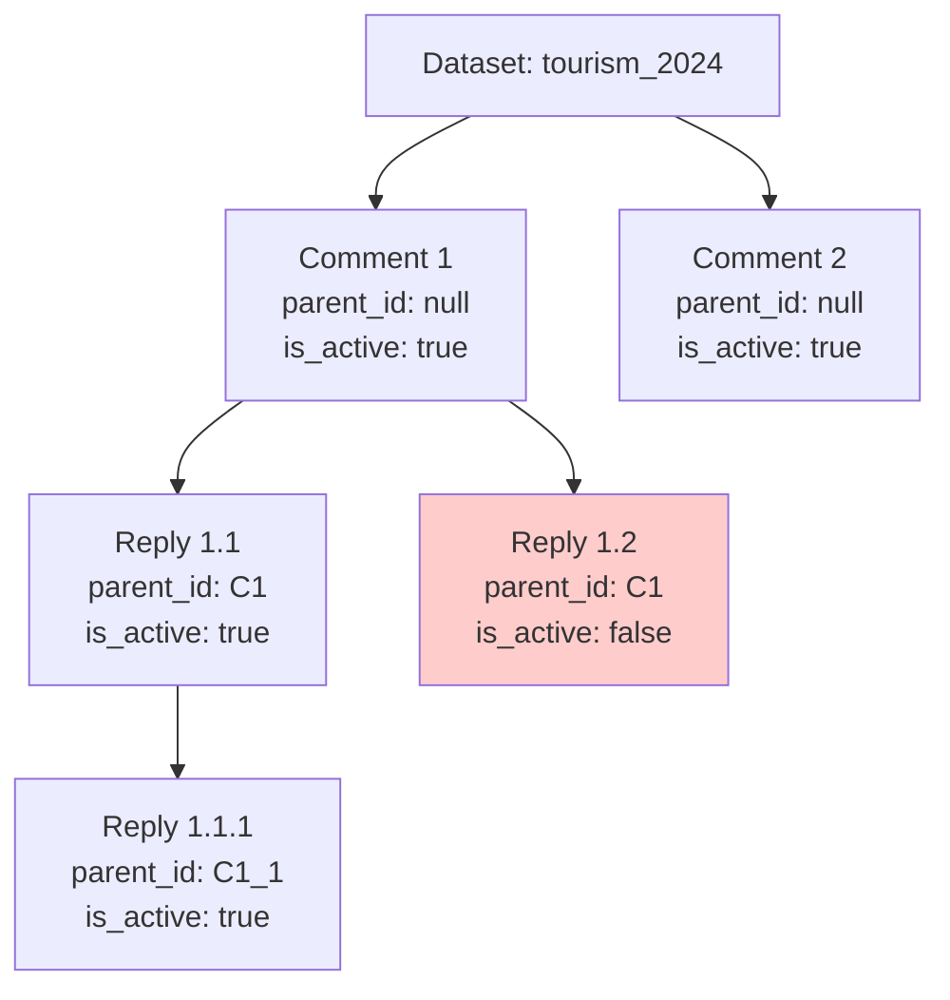

**Indexes:**

```javascript
db.comments.createIndex({ comment_id: 1 }, { unique: true });
db.comments.createIndex({ target_dataset_id: 1, created_at: -1 }); // Get all comments for dataset
db.comments.createIndex({ parent_comment_id: 1 }); // Get replies
db.comments.createIndex({ author_user_id: 1 }); // Get user's comments
db.comments.createIndex({ is_active: 1 }); // Filter disabled comments
```

#### 4.1.4 Votes Collection

**Purpose:** User rating system with duplicate prevention

**Schema Definition:**

```javascript
db.createCollection("votes", {
  validator: {
    $jsonSchema: {
      bsonType: "object",
      required: [
        "vote_id",
        "target_dataset_id",
        "voter_user_id",
        "vote_value",
        "created_at",
      ],
      properties: {
        vote_id: { bsonType: "string" },
        target_dataset_id: { bsonType: "string" },
        voter_user_id: { bsonType: "string" },
        vote_value: {
          bsonType: "int",
          minimum: 1,
          maximum: 5,
          description: "Star rating 1-5",
        },
        created_at: { bsonType: "date" },
      },
    },
  },
});
```

**Indexes:**

```javascript
db.votes.createIndex({ vote_id: 1 }, { unique: true });

// CRITICAL: Prevent duplicate votes from same user
db.votes.createIndex(
  { target_dataset_id: 1, voter_user_id: 1 },
  { unique: true, name: "vote_unique_index" }
);

db.votes.createIndex({ target_dataset_id: 1 }); // Aggregate votes
db.votes.createIndex({ voter_user_id: 1 }); // User's voting history
```

**Vote Constraint Logic:**

```javascript
// In vote.controller.js
async function addVote(req, res) {
  try {
    // MongoDB unique index ensures only one vote per user per dataset
    await db.votes.insertOne({
      vote_id: generateUUID(),
      target_dataset_id: req.params.datasetId,
      voter_user_id: req.user.userId,
      vote_value: req.body.voteValue,
      created_at: new Date(),
    });

    // Update Redis counter
    await incrementCounter(`vote_count:dataset:${req.params.datasetId}`);
  } catch (error) {
    if (error.code === 11000) {
      // Duplicate key error
      return res.status(400).json({ error: "Already voted" });
    }
    throw error;
  }
}
```

#### 4.1.5 Private Messages Collection

**Purpose:** Direct messaging between users

**Schema Definition:**

```javascript
db.createCollection("private_messages", {
  validator: {
    $jsonSchema: {
      bsonType: "object",
      required: [
        "message_id",
        "from_user_id",
        "to_user_id",
        "content",
        "created_at",
      ],
      properties: {
        message_id: { bsonType: "string" },
        from_user_id: { bsonType: "string" },
        to_user_id: { bsonType: "string" },
        content: {
          bsonType: "string",
          minLength: 1,
          maxLength: 5000,
        },
        created_at: { bsonType: "date" },
      },
    },
  },
});
```

**Indexes:**

```javascript
// Bidirectional conversation queries
db.private_messages.createIndex({
  from_user_id: 1,
  to_user_id: 1,
  created_at: -1,
});
db.private_messages.createIndex({
  to_user_id: 1,
  from_user_id: 1,
  created_at: -1,
});
```

**MongoDB Collections Relationship:**

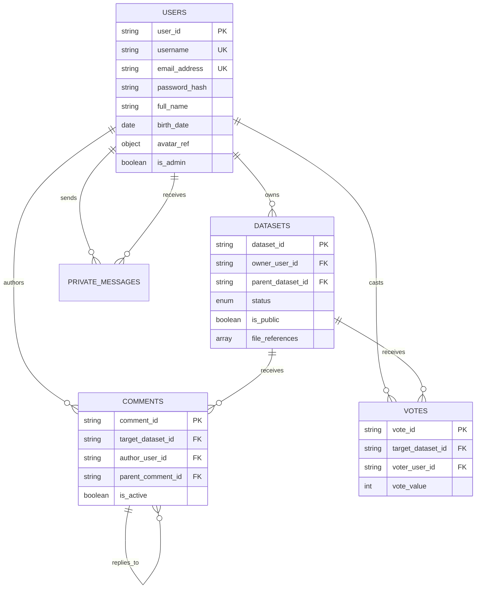

### 4.2 Neo4j - Graph Model

#### 4.2.1 Node Labels

**User Node:**

```cypher
(:User {
  user_id: "00000000-0000-5000-8000-00005a317347",  // UUID from MongoDB
  username: "valeriehernandez"                       // Denormalized for queries
})
```

**Dataset Node:**

```cypher
(:Dataset {
  dataset_id: "valeriehernandez_20250928_001",
  dataset_name: "Costa Rica Tourism Statistics 2024"
})
```

**Constraints (setup-neo4j.js):**

```cypher
// Ensure node uniqueness
CREATE CONSTRAINT user_id_unique IF NOT EXISTS
FOR (u:User) REQUIRE u.user_id IS UNIQUE;

CREATE CONSTRAINT dataset_id_unique IF NOT EXISTS
FOR (d:Dataset) REQUIRE d.dataset_id IS UNIQUE;

// Performance indexes
CREATE INDEX user_username IF NOT EXISTS
FOR (u:User) ON (u.username);

CREATE INDEX dataset_name IF NOT EXISTS
FOR (d:Dataset) ON (d.dataset_name);
```

#### 4.2.2 FOLLOWS Relationship (HU19, HU20)

**Purpose:** User following system for social features

```cypher
(follower:User)-[:FOLLOWS {
  followed_at: datetime("2025-09-28T16:00:00Z")
}]->(followed:User)
```

**Relationship Properties:**

| Property    | Type     | Purpose                    |
| ----------- | -------- | -------------------------- |
| followed_at | DateTime | Timestamp of follow action |

**Use Cases:**

```cypher
// HU19: Follow a user
MATCH (follower:User {user_id: $followerId})
MATCH (followed:User {user_id: $followedId})
CREATE (follower)-[:FOLLOWS {followed_at: datetime()}]->(followed);

// HU20: Get all followers
MATCH (follower:User)-[:FOLLOWS]->(user:User {user_id: $userId})
RETURN follower.user_id, follower.username
ORDER BY follower.username;

// HU20: Get following list
MATCH (user:User {user_id: $userId})-[:FOLLOWS]->(followed:User)
RETURN followed.user_id, followed.username
ORDER BY followed.username;

// HU20: Count followers
MATCH (follower:User)-[:FOLLOWS]->(user:User {user_id: $userId})
RETURN count(follower) AS follower_count;

// HU19: Check if A follows B (for UI state)
MATCH (a:User {user_id: $userAId})-[r:FOLLOWS]->(b:User {user_id: $userBId})
RETURN r IS NOT NULL AS is_following;

// HU19: Get followers for notifications
MATCH (follower:User)-[:FOLLOWS]->(user:User {user_id: $userId})
RETURN follower.user_id;
```

#### 4.2.3 DOWNLOADED Relationship (HU13)

**Purpose:** Track download history and analytics

```cypher
(user:User)-[:DOWNLOADED {
  downloaded_at: datetime("2025-09-28T17:00:00Z")
}]->(dataset:Dataset)
```

**Relationship Properties:**

| Property      | Type     | Purpose               |
| ------------- | -------- | --------------------- |
| downloaded_at | DateTime | Timestamp of download |

**Use Cases:**

```cypher
// HU13: Record download
MATCH (user:User {user_id: $userId})
MATCH (dataset:Dataset {dataset_id: $datasetId})
CREATE (user)-[:DOWNLOADED {downloaded_at: datetime()}]->(dataset);

// HU13: Get download history for dataset
MATCH (u:User)-[d:DOWNLOADED]->(ds:Dataset {dataset_id: $datasetId})
RETURN u.user_id, u.username, d.downloaded_at
ORDER BY d.downloaded_at DESC
LIMIT 100;

// HU13: Count unique downloaders
MATCH (u:User)-[:DOWNLOADED]->(ds:Dataset {dataset_id: $datasetId})
RETURN count(DISTINCT u) AS unique_downloaders;

// HU13: Total downloads (including repeats)
MATCH (u:User)-[d:DOWNLOADED]->(ds:Dataset {dataset_id: $datasetId})
RETURN count(d) AS total_downloads;

// Analytics: Most downloaded datasets
MATCH (u:User)-[:DOWNLOADED]->(ds:Dataset)
RETURN ds.dataset_id, ds.dataset_name, count(u) AS download_count
ORDER BY download_count DESC
LIMIT 10;
```

**Neo4j Graph Visualization:**

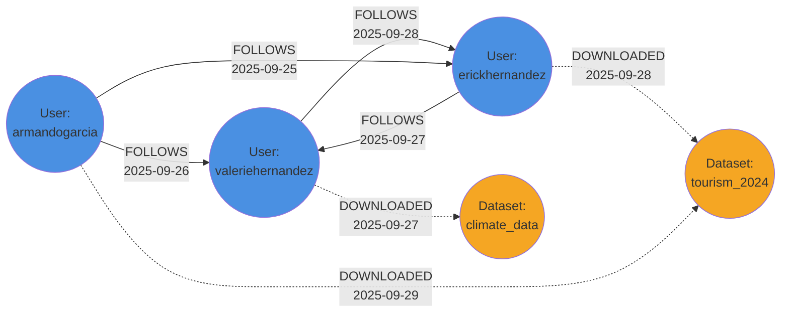

### 4.3 Redis - Key-Value Store

#### 4.3.1 Data Structure Strategy

Redis is used for three distinct patterns:

1. **Counters** (String type) - Download and vote tallies
2. **Lists** (List type) - FIFO notification queues
3. **Cache** (future enhancement) - Query result caching

#### 4.3.2 Download Counters (HU13)

**Key Pattern:** `download_count:dataset:{dataset_id}`

**Data Type:** String (Integer)

**Purpose:** Track total downloads with atomic operations

```redis
# Initialize counter (setup-redis.js)
SET download_count:dataset:valeriehernandez_20250928_001 0

# Increment on download (dataset.controller.js -> downloadFile)
INCR download_count:dataset:valeriehernandez_20250928_001
# Returns: 1

INCR download_count:dataset:valeriehernandez_20250928_001
# Returns: 2

# Retrieve count (dataset.controller.js -> getDownloadStats)
GET download_count:dataset:valeriehernandez_20250928_001
# Returns: "2"
```

**Implementation (redis-counters.js):**

```javascript
async function incrementCounter(key, amount = 1) {
  const { primary } = getRedis();
  const newValue = await primary.incrBy(key, amount);
  return newValue;
}

async function getCounter(key) {
  const { replica } = getRedis(); // Read from replica for scaling
  const value = await replica.get(key);
  return value ? parseInt(value, 10) : 0;
}
```

#### 4.3.3 Vote Counters (HU17)

**Key Pattern:** `vote_count:dataset:{dataset_id}`

**Data Type:** String (Integer)

**Purpose:** Real-time vote tallies with atomic increment/decrement

```redis
# Initialize (setup-redis.js)
SET vote_count:dataset:valeriehernandez_20250928_001 0

# User adds vote
INCR vote_count:dataset:valeriehernandez_20250928_001
# Returns: 1

# User removes vote
DECR vote_count:dataset:valeriehernandez_20250928_001
# Returns: 0

# Ensure non-negative (redis-counters.js)
# If DECR would go below 0, SET to 0 instead
```

**Decrement with Floor at Zero:**

```javascript
async function decrementCounter(key, amount = 1) {
  const { primary } = getRedis();
  const currentValue = await getCounter(key);
  const newValue = Math.max(0, currentValue - amount);
  await primary.set(key, newValue);
  return newValue;
}
```

#### 4.3.4 Notification Queues (HU19)

**Key Pattern:** `notifications:user:{user_id}`

**Data Type:** List (FIFO Queue)

**Purpose:** Store ordered notifications for each user

**Notification Message Format (JSON):**

```javascript
// Type 1: New Follower
{
  "type": "new_follower",
  "from_user_id": "00000000-0000-5000-8000-000004637677",
  "from_username": "erickhernandez",
  "timestamp": "2025-09-28T17:00:00Z"
}

// Type 2: New Dataset from Followed User
{
  "type": "new_dataset",
  "from_user_id": "00000000-0000-5000-8000-000004637677",
  "dataset_id": "erickhernandez_20250929_001",
  "dataset_name": "Climate Analysis 2024",
  "timestamp": "2025-09-29T10:00:00Z"
}

// Type 3: Dataset Approved by Admin
{
  "type": "dataset_approved",
  "dataset_id": "valeriehernandez_20250928_001",
  "dataset_name": "Tourism Statistics",
  "timestamp": "2025-09-29T14:30:00Z"
}

// Type 4: Dataset Rejected by Admin
{
  "type": "dataset_rejected",
  "dataset_id": "valeriehernandez_20250928_002",
  "dataset_name": "Invalid Dataset",
  "timestamp": "2025-09-29T15:00:00Z"
}
```

**Redis Operations:**

```redis
# Add notification (LPUSH = add to left/head)
LPUSH notifications:user:00000000-0000-5000-8000-00005a317347 '{"type":"new_follower","from_username":"erickhernandez","timestamp":"2025-09-28T17:00:00Z"}'

# Get latest 10 notifications (0 = head, 9 = 10th element)
LRANGE notifications:user:00000000-0000-5000-8000-00005a317347 0 9

# Get total count
LLEN notifications:user:00000000-0000-5000-8000-00005a317347
# Returns: 4

# Trim to keep only last 50 (memory management)
LTRIM notifications:user:00000000-0000-5000-8000-00005a317347 0 49
```

**Implementation (notifications.js):**

```javascript
async function sendNotification(userId, notification) {
  const { primary } = getRedis();
  const key = `notifications:user:${userId}`;

  // Add to queue
  await primary.lPush(key, JSON.stringify(notification));

  // Keep only last 50 notifications
  await primary.lTrim(key, 0, 49);
}

async function getNotifications(userId, limit = 50) {
  const { replica } = getRedis();
  const key = `notifications:user:${userId}`;

  const notifications = await replica.lRange(key, 0, limit - 1);
  return notifications.map((n) => JSON.parse(n));
}
```

**Redis Data Structure Visualization:**

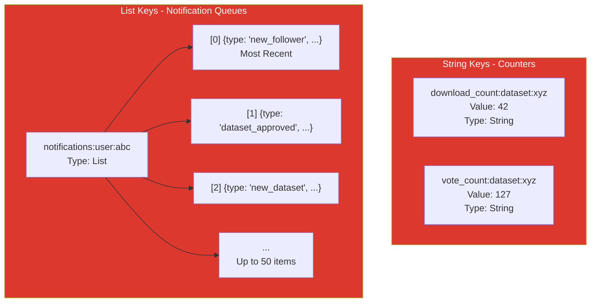

### 4.4 CouchDB - Document Store with Attachments

#### 4.4.1 Document Types

CouchDB stores three types of documents, each containing binary attachments:

1. **User Avatars** (`avatar_{user_id}`)
2. **Dataset Files** (`file_{dataset_id}_{sequence}`)
3. **Header Photos** (`photo_{dataset_id}_header`)

#### 4.4.2 User Avatar Documents (HU1, HU4)

**Document ID Pattern:** `avatar_{user_id}`

**Purpose:** Store user profile pictures

**Document Structure:**

```json
{
  "_id": "avatar_00000000-0000-5000-8000-00005a317347",
  "_rev": "1-abc123def456",

  "type": "user_avatar",
  "owner_user_id": "00000000-0000-5000-8000-00005a317347",
  "uploaded_at": "2025-09-28T10:00:00Z",

  "_attachments": {
    "profile.jpg": {
      "content_type": "image/jpeg",
      "length": 204800,
      "stub": true
    }
  }
}
```

**Field Constraints:**

| Field         | Type   | Constraints                       | Validation Location             |
| ------------- | ------ | --------------------------------- | ------------------------------- |
| type          | String | Must be "user_avatar"             | Set in `couchdb-manager.js`     |
| owner_user_id | String | Must exist in MongoDB users       | Validated before upload         |
| \_attachments | Object | Single file only                  | Enforced in multer config       |
| content_type  | String | image/jpeg, image/png, image/webp | Checked in `couchdb-manager.js` |
| length        | Number | ≤ 2 MB (2,097,152 bytes)          | Validated in multer middleware  |

**Upload Process (couchdb-manager.js):**

```javascript
async function uploadFile(docId, file, metadata) {
  const couchdb = getCouchDB();
  const db = couchdb.db.use("datec");

  // Validate file size
  const maxSize =
    metadata.type === "user_avatar"
      ? 2 * 1024 * 1024 // 2MB
      : metadata.type === "header_photo"
      ? 5 * 1024 * 1024 // 5MB
      : 1024 * 1024 * 1024; // 1GB

  if (file.size > maxSize) {
    throw new Error(`File exceeds maximum size`);
  }

  // Create document with attachment
  const document = {
    _id: docId,
    type: metadata.type,
    owner_user_id: metadata.owner_user_id,
    uploaded_at: new Date().toISOString(),
    _attachments: {
      [file.originalname]: {
        content_type: file.mimetype,
        data: file.buffer.toString("base64"),
      },
    },
  };

  await db.insert(document);

  return {
    couchdb_document_id: docId,
    file_name: file.originalname,
    file_size_bytes: file.size,
    mime_type: file.mimetype,
  };
}
```

#### 4.4.3 Dataset File Documents (HU5)

**Document ID Pattern:** `file_{dataset_id}_{sequence}`

**Purpose:** Store dataset data files (CSV, Excel, JSON)

**Document Structure:**

```json
{
  "_id": "file_valeriehernandez_20250928_001_001",
  "_rev": "1-def456ghi789",

  "type": "dataset_file",
  "owner_user_id": "00000000-0000-5000-8000-00005a317347",
  "dataset_id": "valeriehernandez_20250928_001",
  "uploaded_at": "2025-09-28T10:30:00Z",

  "_attachments": {
    "tourism_data_2024.csv": {
      "content_type": "text/csv",
      "length": 15728640,
      "stub": true
    }
  }
}
```

**Field Constraints:**

| Field         | Type   | Constraints                                                                                                                         | Notes                               |
| ------------- | ------ | ----------------------------------------------------------------------------------------------------------------------------------- | ----------------------------------- |
| dataset_id    | String | Must match MongoDB datasets.dataset_id                                                                                              | Foreign key reference               |
| \_attachments | Object | 1 file per document                                                                                                                 | Multiple files = multiple documents |
| content_type  | String | text/csv, application/json, text/plain, application/vnd.ms-excel, application/vnd.openxmlformats-officedocument.spreadsheetml.sheet | Validated in multer                 |
| length        | Number | ≤ 1 GB (1,073,741,824 bytes)                                                                                                        | Hard limit enforced                 |

**Multiple Files Handling:**

```javascript
// In dataset.controller.js
async function createDataset(req, res) {
  const files = req.files["data_files"]; // Array of files
  const fileReferences = [];

  for (let i = 0; i < files.length; i++) {
    const docId = `file_${datasetId}_${String(i + 1).padStart(3, "0")}`;
    const fileRef = await uploadFile(docId, files[i], {
      type: "dataset_file",
      owner_user_id: req.user.userId,
      dataset_id: datasetId,
    });
    fileReferences.push(fileRef);
  }

  // Store references in MongoDB
  await db.datasets.insertOne({
    dataset_id: datasetId,
    file_references: fileReferences,
    // ... other fields
  });
}
```

#### 4.4.4 Header Photo Documents (HU5)

**Document ID Pattern:** `photo_{dataset_id}_header`

**Purpose:** Store dataset header/banner images

**Document Structure:**

```json
{
  "_id": "photo_valeriehernandez_20250928_001_header",
  "_rev": "1-ghi789jkl012",

  "type": "header_photo",
  "owner_user_id": "00000000-0000-5000-8000-00005a317347",
  "dataset_id": "valeriehernandez_20250928_001",
  "uploaded_at": "2025-09-28T10:15:00Z",

  "_attachments": {
    "header.jpg": {
      "content_type": "image/jpeg",
      "length": 2048000,
      "stub": true
    }
  }
}
```

**Field Constraints:**

| Field        | Constraints                       | Recommended Specs                 |
| ------------ | --------------------------------- | --------------------------------- |
| length       | ≤ 5 MB                            | -                                 |
| content_type | image/jpeg, image/png, image/webp | JPEG for photos, PNG for graphics |
| dimensions   | -                                 | 1200x400px (3:1 aspect ratio)     |

#### 4.4.5 Design Documents (Views)

**Purpose:** Query documents by type and owner

**Setup (setup-couchdb.js):**

```javascript
// View for user avatars
await datecDB.insert({
  _id: "_design/users",
  views: {
    by_user_id: {
      map: function (doc) {
        if (doc.type === "user_avatar") {
          emit(doc.owner_user_id, doc);
        }
      }.toString(),
    },
  },
});

// View for dataset files
await datecDB.insert({
  _id: "_design/datasets",
  views: {
    by_dataset_id: {
      map: function (doc) {
        if (doc.type === "dataset_file" || doc.type === "header_photo") {
          emit(doc.dataset_id, doc);
        }
      }.toString(),
    },
    by_owner: {
      map: function (doc) {
        if (doc.type === "dataset_file" || doc.type === "header_photo") {
          emit(doc.owner_user_id, doc);
        }
      }.toString(),
    },
  },
});
```

**CouchDB Document Structure:**

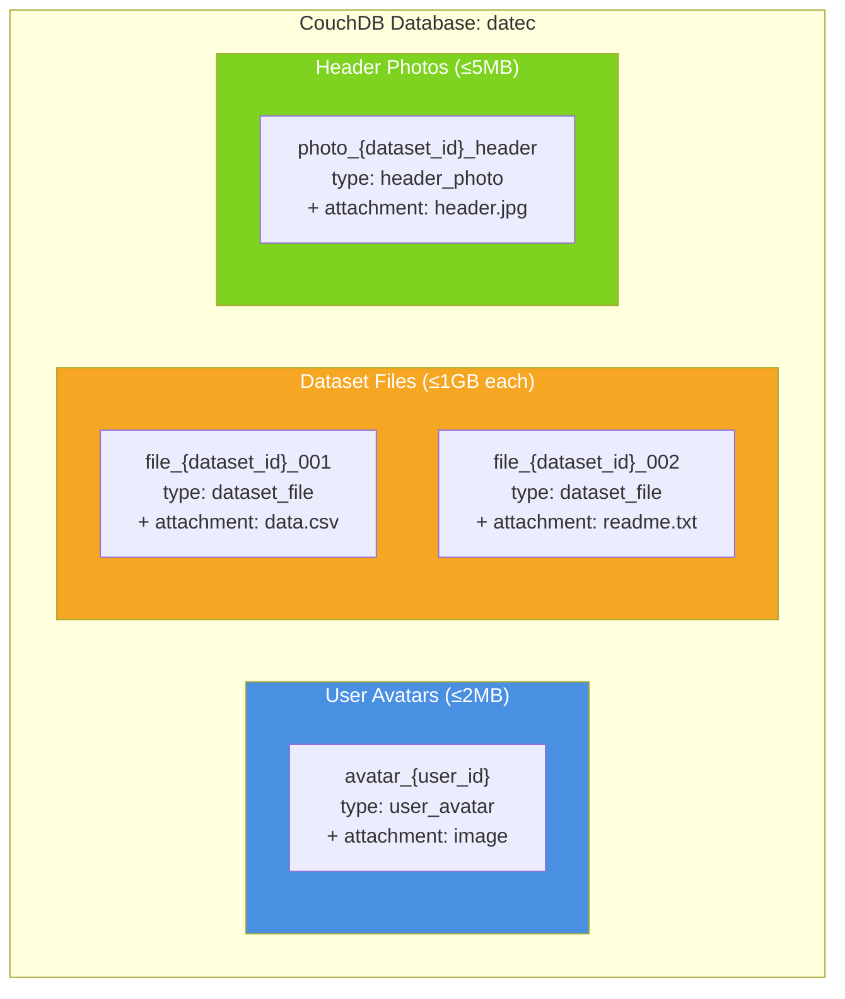

## 5. Cross-Database Integration

### 5.1 Data Flow Patterns

#### 5.1.1 User Registration Flow (HU1)

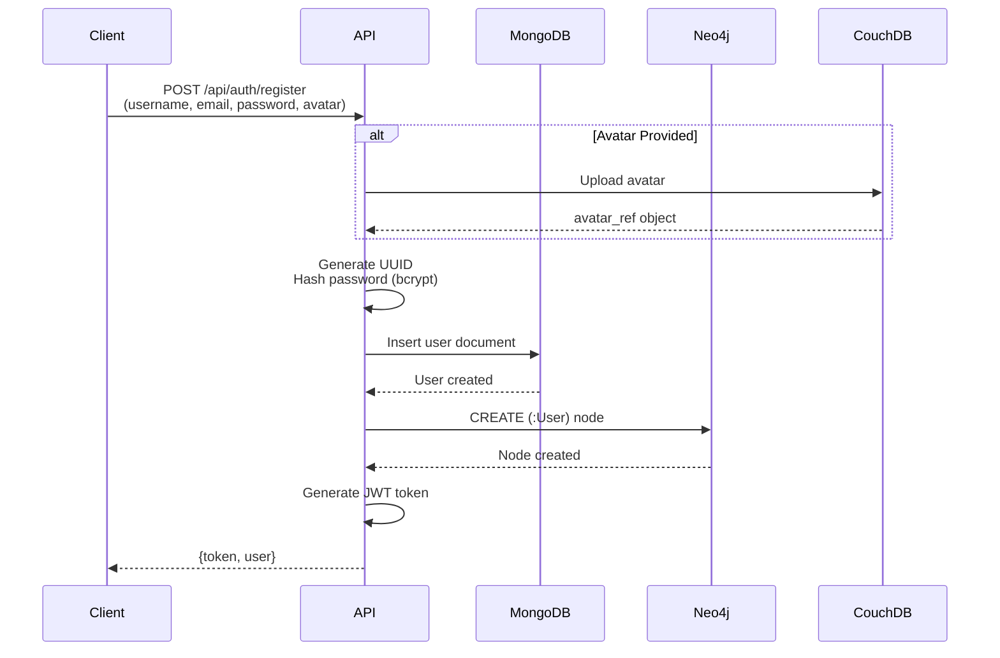

**Implementation (auth.controller.js):**

```javascript
async function register(req, res) {
  const userId = generateUUID();
  let avatarRef = null;

  // 1. Upload avatar to CouchDB (if provided)
  if (req.file) {
    avatarRef = await uploadFile(`avatar_${userId}`, req.file, {
      type: "user_avatar",
      owner_user_id: userId,
    });
  }

  // 2. Insert into MongoDB
  await db.users.insertOne({
    user_id: userId,
    username: req.body.username,
    email_address: req.body.email_address,
    password_hash: await bcrypt.hash(req.body.password, 12),
    full_name: req.body.full_name,
    birth_date: new Date(req.body.birth_date),
    avatar_ref: avatarRef,
    is_admin: false,
    created_at: new Date(),
    updated_at: new Date(),
  });

  // 3. Create Neo4j node
  await neo4j.run(`CREATE (u:User {user_id: $userId, username: $username})`, {
    userId,
    username: req.body.username,
  });

  // 4. Generate token
  const token = jwt.sign(
    { userId, username: req.body.username },
    process.env.JWT_SECRET
  );

  res.status(201).json({
    success: true,
    token,
    user: { userId, username: req.body.username },
  });
}
```

#### 5.1.2 Dataset Creation Flow (HU5)

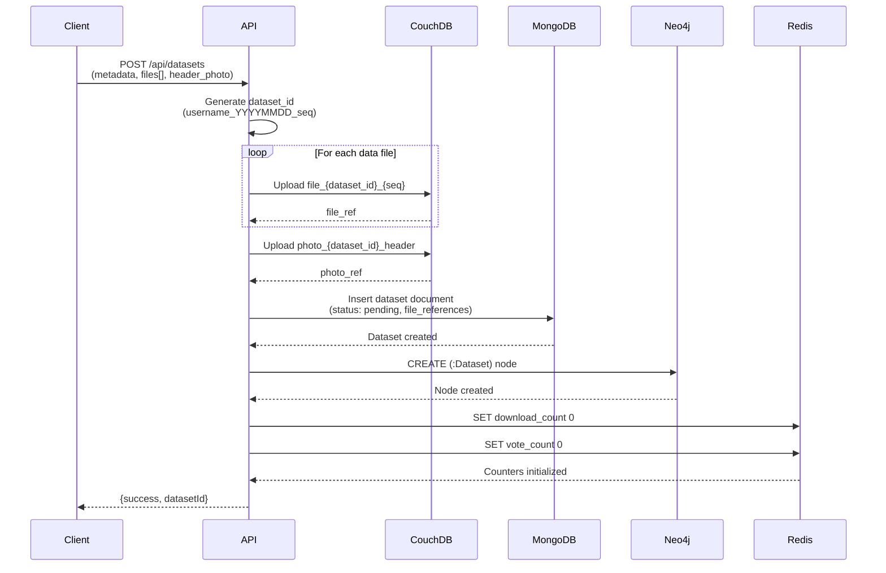

#### 5.1.3 Dataset Download Flow (HU13)

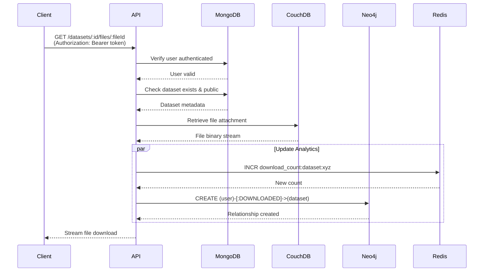

**Implementation (dataset.controller.js):**

```javascript
async function downloadFile(req, res) {
  const { datasetId, fileId } = req.params;
  const userId = req.user.userId;

  // 1. Verify dataset exists and is accessible
  const dataset = await db.datasets.findOne({ dataset_id: datasetId });
  if (!dataset || (!dataset.is_public && dataset.owner_user_id !== userId)) {
    return res.status(404).json({ error: "Dataset not found" });
  }

  // 2. Get file from CouchDB
  const fileRef = dataset.file_references.find(
    (f) => f.couchdb_document_id === fileId
  );
  const fileUrl = getFileUrl(fileRef.couchdb_document_id, fileRef.file_name);

  // 3. Update analytics (parallel operations)
  await Promise.all([
    // Increment Redis counter
    incrementCounter(`download_count:dataset:${datasetId}`),

    // Record in Neo4j
    neo4j.run(
      `MATCH (u:User {user_id: $userId})
       MATCH (d:Dataset {dataset_id: $datasetId})
       CREATE (u)-[:DOWNLOADED {downloaded_at: datetime()}]->(d)`,
      { userId, datasetId }
    ),
  ]);

  // 4. Stream file
  res.redirect(fileUrl);
}
```

#### 5.1.4 Follow User with Notification Flow (HU19)

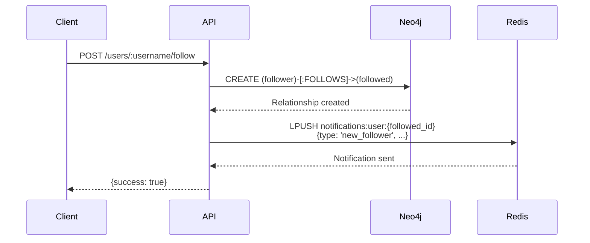

### 5.2 Data Consistency Strategies

#### 5.2.1 Transactional Operations

**Problem:** Operations span multiple databases (no distributed transactions)

**Solution:** Compensating transactions + idempotency

```javascript
async function createDataset(req, res) {
  let datasetId,
    couchdbFiles = [],
    neo4jCreated = false,
    mongoCreated = false;

  try {
    // Step 1: Generate ID
    datasetId = generateDatasetId(req.user.username);

    // Step 2: Upload files to CouchDB
    couchdbFiles = await uploadFiles(datasetId, req.files);

    // Step 3: Insert MongoDB document
    await db.datasets.insertOne({ dataset_id: datasetId /* ... */ });
    mongoCreated = true;

    // Step 4: Create Neo4j node
    await neo4j.run(`CREATE (:Dataset {dataset_id: $datasetId})`, {
      datasetId,
    });
    neo4jCreated = true;

    // Step 5: Initialize Redis counters
    await initCounter(`download_count:dataset:${datasetId}`, 0);
    await initCounter(`vote_count:dataset:${datasetId}`, 0);

    res.status(201).json({ success: true, datasetId });
  } catch (error) {
    // Rollback: Delete created resources
    if (couchdbFiles.length > 0) {
      for (const file of couchdbFiles) {
        await deleteFile(file.couchdb_document_id).catch(() => {});
      }
    }
    if (mongoCreated) {
      await db.datasets.deleteOne({ dataset_id: datasetId }).catch(() => {});
    }
    if (neo4jCreated) {
      await neo4j
        .run(`MATCH (d:Dataset {dataset_id: $datasetId}) DELETE d`, {
          datasetId,
        })
        .catch(() => {});
    }

    throw error;
  }
}
```

#### 5.2.2 Eventual Consistency

**Redis Counters → MongoDB Sync**

**Problem:** Redis counters can drift from MongoDB vote/download counts

**Solution:** Background sync job (future enhancement)

```javascript
// Pseudocode for background job
async function syncCounters() {
  // Get all datasets
  const datasets = await db.datasets.find({}).toArray();

  for (const dataset of datasets) {
    // Sync download count
    const actualDownloads = await neo4j.run(
      `MATCH ()-[d:DOWNLOADED]->(ds:Dataset {dataset_id: $datasetId})
       RETURN count(d) AS count`,
      { datasetId: dataset.dataset_id }
    );
    await setCounter(
      `download_count:dataset:${dataset.dataset_id}`,
      actualDownloads
    );

    // Sync vote count
    const actualVotes = await db.votes.countDocuments({
      target_dataset_id: dataset.dataset_id,
    });
    await setCounter(`vote_count:dataset:${dataset.dataset_id}`, actualVotes);
  }
}

// Run every 5 minutes
setInterval(syncCounters, 5 * 60 * 1000);
```

## 6. API Overview

### 6.1 Endpoint Summary by Module

#### Authentication Routes (3 endpoints)

| Method | Endpoint           | Auth | User Story | Description                             |
| ------ | ------------------ | ---- | ---------- | --------------------------------------- |
| POST   | /api/auth/register | No   | HU1        | Register new user with optional avatar  |
| POST   | /api/auth/login    | No   | HU1        | Authenticate user and receive JWT token |
| GET    | /api/auth/me       | Yes  | -          | Get current authenticated user info     |

**Databases Used:** MongoDB (users), Neo4j (User nodes), CouchDB (avatars)

---

#### User Routes (8 endpoints)

| Method | Endpoint                       | Auth  | User Story | Description                             |
| ------ | ------------------------------ | ----- | ---------- | --------------------------------------- |
| GET    | /api/users/search              | No    | HU14       | Search users by username or full name   |
| GET    | /api/users/:username           | No    | -          | Get public user profile                 |
| PUT    | /api/users/:username           | Yes   | HU4        | Update own profile with optional avatar |
| PATCH  | /api/users/:username/promote   | Admin | HU3        | Promote/demote user admin status        |
| POST   | /api/users/:username/follow    | Yes   | HU19       | Follow another user                     |
| DELETE | /api/users/:username/follow    | Yes   | HU19       | Unfollow user                           |
| GET    | /api/users/:username/followers | No    | HU20       | Get list of user's followers            |
| GET    | /api/users/:username/following | No    | HU20       | Get list of users being followed        |

**Databases Used:** MongoDB (users), Neo4j (FOLLOWS relationships), CouchDB (avatars), Redis (notifications)

---

#### Dataset Routes (10 endpoints)

| Method | Endpoint                                | Auth | User Story | Description                                    |
| ------ | --------------------------------------- | ---- | ---------- | ---------------------------------------------- |
| POST   | /api/datasets                           | Yes  | HU5        | Create new dataset with files and header photo |
| GET    | /api/datasets/search                    | No   | HU9        | Search datasets by name, description, or tags  |
| GET    | /api/datasets/user/:username            | No   | HU12       | Get all datasets from specific user            |
| GET    | /api/datasets/:datasetId                | No   | HU10       | Get dataset details and metadata               |
| PATCH  | /api/datasets/:datasetId/review-request | Yes  | HU6        | Request admin approval for dataset             |
| PATCH  | /api/datasets/:datasetId/visibility     | Yes  | HU7        | Toggle dataset public/private                  |
| DELETE | /api/datasets/:datasetId                | Yes  | HU7        | Delete dataset (soft or hard delete)           |
| POST   | /api/datasets/:datasetId/clone          | Yes  | HU18       | Clone existing dataset with new name           |
| GET    | /api/datasets/:datasetId/download       | Yes  | HU13       | Download complete dataset as ZIP               |
| GET    | /api/datasets/:datasetId/downloads      | Yes  | HU13       | Get download statistics (owner only)           |
| GET    | /api/datasets/:datasetId/files/:fileId  | Yes  | HU13       | Download specific file from dataset            |

**Databases Used:** All 4 databases (MongoDB, Neo4j, Redis, CouchDB)

---

#### Vote Routes (4 endpoints)

| Method | Endpoint                          | Auth | User Story | Description                       |
| ------ | --------------------------------- | ---- | ---------- | --------------------------------- |
| GET    | /api/datasets/:datasetId/votes    | No   | HU17       | Get vote count and average rating |
| POST   | /api/datasets/:datasetId/votes    | Yes  | HU17       | Add or update vote (1-5 stars)    |
| DELETE | /api/datasets/:datasetId/votes    | Yes  | HU17       | Remove own vote from dataset      |
| GET    | /api/datasets/:datasetId/votes/me | Yes  | HU17       | Check if current user voted       |

**Databases Used:** MongoDB (votes collection), Redis (vote_count counters)

---

#### Comment Routes (2 endpoints)

| Method | Endpoint                          | Auth | User Story | Description                              |
| ------ | --------------------------------- | ---- | ---------- | ---------------------------------------- |
| GET    | /api/datasets/:datasetId/comments | No   | HU15       | Get comment tree with nested replies     |
| POST   | /api/datasets/:datasetId/comments | Yes  | HU15       | Add comment or reply to existing comment |

**Databases Used:** MongoDB (comments collection)

---

#### Message Routes (2 endpoints)

| Method | Endpoint                            | Auth | User Story | Description                               |
| ------ | ----------------------------------- | ---- | ---------- | ----------------------------------------- |
| POST   | /api/messages/:fromUsername/:toUser | Yes  | HU21       | Send private message to user              |
| GET    | /api/messages/:fromUsername/:toUser | Yes  | HU21       | Get conversation thread between two users |

**Databases Used:** MongoDB (private_messages collection)

---

#### Notification Routes (3 endpoints)

| Method | Endpoint                 | Auth | User Story | Description                          |
| ------ | ------------------------ | ---- | ---------- | ------------------------------------ |
| GET    | /api/notifications       | Yes  | HU19       | Get user's notifications (latest 50) |
| GET    | /api/notifications/count | Yes  | HU19       | Get unread notification count        |
| DELETE | /api/notifications       | Yes  | -          | Clear all notifications for user     |

**Databases Used:** Redis (notification lists)

---

#### Admin Routes (6 endpoints)

| Method | Endpoint                               | Auth  | User Story | Description                         |
| ------ | -------------------------------------- | ----- | ---------- | ----------------------------------- |
| GET    | /api/admin/datasets/pending            | Admin | HU8        | List all datasets awaiting approval |
| PATCH  | /api/admin/datasets/:datasetId         | Admin | HU8        | Approve or reject dataset           |
| PATCH  | /api/admin/comments/:commentId/enable  | Admin | HU16       | Re-enable disabled comment          |
| PATCH  | /api/admin/comments/:commentId/disable | Admin | HU16       | Disable comment (soft delete)       |
| GET    | /api/admin/comments/disabled           | Admin | HU16       | List all disabled comments          |
| GET    | /api/admin/stats                       | Admin | -          | Get platform statistics             |

**Databases Used:** MongoDB (datasets, comments), Redis (notifications)

---

### 6.2 Database Operations by Endpoint

| Endpoint Pattern                | MongoDB                 | Neo4j                  | Redis                | CouchDB           |
| ------------------------------- | ----------------------- | ---------------------- | -------------------- | ----------------- |
| /api/auth/register              | ✅ Insert user          | ✅ Create User node    | ❌                   | ✅ Upload avatar  |
| /api/auth/login                 | ✅ Verify credentials   | ❌                     | ❌                   | ❌                |
| /api/users/:username            | ✅ Read user            | ❌                     | ❌                   | ✅ Get avatar URL |
| /api/users/:username/follow     | ❌                      | ✅ Create FOLLOWS      | ✅ Send notification | ❌                |
| /api/datasets (POST)            | ✅ Insert dataset       | ✅ Create Dataset node | ✅ Init counters     | ✅ Upload files   |
| /api/datasets/search            | ✅ Text search          | ❌                     | ❌                   | ❌                |
| /api/datasets/:id/files/:fileId | ✅ Verify access        | ✅ Create DOWNLOADED   | ✅ Increment counter | ✅ Stream file    |
| /api/datasets/:id/votes (POST)  | ✅ Insert vote          | ❌                     | ✅ Increment counter | ❌                |
| /api/datasets/:id/comments      | ✅ Insert/Read comments | ❌                     | ❌                   | ❌                |
| /api/messages/:from/:to         | ✅ Insert/Read messages | ❌                     | ❌                   | ❌                |
| /api/notifications              | ❌                      | ❌                     | ✅ Read list         | ❌                |
| /api/admin/datasets/:id         | ✅ Update status        | ❌                     | ✅ Send notification | ❌                |

### 6.3 User Story to Endpoint Mapping

| User Story               | Primary Endpoint(s)                                                  | Additional Operations                        |
| ------------------------ | -------------------------------------------------------------------- | -------------------------------------------- |
| HU1 - User Registration  | POST /api/auth/register                                              | MongoDB insert + Neo4j node + CouchDB avatar |
| HU2 - Admin User         | Seeded in setup-mongo.js                                             | Initial admin user created                   |
| HU3 - Promote Admin      | PATCH /api/users/:username/promote                                   | MongoDB update is_admin flag                 |
| HU4 - Edit Profile       | PUT /api/users/:username                                             | MongoDB update + optional CouchDB avatar     |
| HU5 - Create Dataset     | POST /api/datasets                                                   | All 4 databases involved                     |
| HU6 - Request Approval   | PATCH /api/datasets/:id/review-request                               | MongoDB status update                        |
| HU7 - Toggle Visibility  | PATCH /api/datasets/:id/visibility, DELETE /api/datasets/:id         | MongoDB + cleanup in other DBs               |
| HU8 - Approve Dataset    | PATCH /api/admin/datasets/:id                                        | MongoDB update + Redis notification          |
| HU9 - Search Datasets    | GET /api/datasets/search                                             | MongoDB text search index                    |
| HU10 - View Dataset      | GET /api/datasets/:id                                                | MongoDB read                                 |
| HU11 - Video Tutorials   | Stored in dataset.tutorial_video_ref                                 | MongoDB field (URL string)                   |
| HU12 - User's Datasets   | GET /api/datasets/user/:username                                     | MongoDB filtered query                       |
| HU13 - Download Tracking | GET /api/datasets/:id/files/:fileId, GET /api/datasets/:id/downloads | CouchDB + Neo4j + Redis                      |
| HU14 - Search Users      | GET /api/users/search                                                | MongoDB text search                          |
| HU15 - Comments          | POST/GET /api/datasets/:id/comments                                  | MongoDB hierarchical structure               |
| HU16 - Disable Comment   | PATCH /api/admin/comments/:id/disable                                | MongoDB soft delete (is_active)              |
| HU17 - Vote Dataset      | POST/DELETE /api/datasets/:id/votes                                  | MongoDB + Redis counter                      |
| HU18 - Clone Dataset     | POST /api/datasets/:id/clone                                         | All 4 databases                              |
| HU19 - Follow User       | POST /api/users/:username/follow                                     | Neo4j relationship + Redis notification      |
| HU20 - View Followers    | GET /api/users/:username/followers                                   | Neo4j graph query                            |
| HU21 - Private Messages  | POST/GET /api/messages/:from/:to                                     | MongoDB conversation thread                  |

---

## 7. Installation Guide

### 7.1 Prerequisites

| Software       | Version   | Purpose                    |
| -------------- | --------- | -------------------------- |
| Node.js        | v22.20.0+ | Backend runtime            |
| Docker Desktop | Latest    | MongoDB + Redis containers |
| Neo4j Desktop  | 2.0.4+    | Graph database             |
| CouchDB        | 3.5.0     | File storage               |
| Git            | Latest    | Version control            |

### 7.2 Quick Start

```bash
# 1. Clone repository
git clone https://github.com/your-repo/DaTEC-Sharing-Site.git
cd DaTEC-Sharing-Site

# 2. Start Docker containers
cd database/datec-db
docker-compose up -d

# 3. Initialize databases
cd scripts
npm install
node setup-mongo.js
node setup-redis.js
node setup-neo4j.js
node setup-couchdb.js

# 4. Configure backend
cd ../../backend
npm install
cp .env.example .env
# Edit .env with your settings

# 5. Configure frontend
cd ../frontend
npm install
cp .env.example .env

# 6. Start servers
# Terminal 1 - Backend
cd backend
npm run dev

# Terminal 2 - Frontend
cd frontend
npm run dev
```

### 7.3 Environment Configuration

**Backend (.env):**

```env
PORT=3000
NODE_ENV=development
JWT_SECRET=your_secret_key_minimum_32_characters

# MongoDB Replica Set
MONGO_URI=mongodb://localhost:27017,localhost:27018/datec?replicaSet=datecRS

# Redis Primary-Replica
REDIS_PRIMARY_HOST=localhost
REDIS_PRIMARY_PORT=6379
REDIS_REPLICA_HOST=localhost
REDIS_REPLICA_PORT=6380

# Neo4j
NEO4J_URI=bolt://localhost:7687
NEO4J_USER=neo4j
NEO4J_PASSWORD=dat3c_master_4dmin

# CouchDB
COUCHDB_URL=http://localhost:5984
COUCHDB_USER=sudod4t3c
COUCHDB_PASSWORD=dat3c_master_4dmin
```

**Frontend (.env):**

```env
VITE_API_URL=http://localhost:3000/api
```

### 7.4 Verification

```bash
# Check Docker containers
docker ps
# Should show: datec-mongo-primary, datec-mongo-secondary, datec-redis-primary, datec-redis-replica

# Test API health
curl http://localhost:3000/api/health

# Test default admin login
curl -X POST http://localhost:3000/api/auth/login \
  -H "Content-Type: application/json" \
  -d '{"username":"sudod4t3c","password":"dat3c_master_4dmin"}'
```

### 7.5 Default Credentials

| Service      | Username  | Password           |
| ------------ | --------- | ------------------ |
| System Admin | sudod4t3c | dat3c_master_4dmin |
| Neo4j        | neo4j     | dat3c_master_4dmin |
| CouchDB      | sudod4t3c | dat3c_master_4dmin |

## 8. Conclusion

### 8.1 Database Selection Summary

DaTEC successfully demonstrates **polyglot persistence** by selecting the optimal database for each specific requirement:

| Database    | Selected For                               | Key Advantage                                                |
| ----------- | ------------------------------------------ | ------------------------------------------------------------ |
| **MongoDB** | Users, Datasets, Comments, Votes, Messages | Document model, ACID transactions, text search, replica sets |
| **Neo4j**   | Social graph (FOLLOWS, DOWNLOADED)         | Constant-time graph traversals, powerful Cypher queries      |
| **Redis**   | Counters, Notifications                    | Sub-millisecond operations, atomic increments, FIFO queues   |
| **CouchDB** | Binary files (avatars, datasets, photos)   | Native HTTP streaming, no chunking, simple attachment model  |

### 8.2 Multi-Node Architecture Benefits

The deployment of MongoDB replica set and Redis primary-replica provides:

1. **High Availability:** Automatic failover capabilities
2. **Data Redundancy:** Complete data replication across nodes
3. **Read Scaling:** Distributed read operations
4. **Zero Downtime:** Rolling maintenance and upgrades
5. **Data Safety:** Persistence and replication guarantees

### 8.3 Technical Achievements

✅ **21 User Stories** fully implemented across all system layers  
✅ **4 Databases** working cohesively with clear separation of concerns  
✅ **Multi-Node Deployment** for MongoDB and Redis in Docker containers  
✅ **Cross-Database Consistency** through compensating transactions  
✅ **Optimized Queries** using appropriate indexes and data structures  
✅ **RESTful API** with 35+ endpoints supporting all platform features  
✅ **Professional Code Structure** with reusable utilities and middleware

### 8.4 Key Design Decisions

**Decision 1: CouchDB over GridFS**

- **Reason:** GridFS chunks files into 255KB pieces, adding complexity. CouchDB stores files as single attachments with simpler HTTP-based retrieval.

**Decision 2: Neo4j over ArangoDB**

- **Reason:** Neo4j's Cypher language is more mature and widely documented. Native graph structure provides better performance for social features.

**Decision 3: Redis Lists for Notifications**

- **Reason:** LPUSH/LRANGE operations provide natural FIFO queue behavior. Lists maintain insertion order critical for notification timelines.

**Decision 4: MongoDB Replica Set over Single Instance**

- **Reason:** Project requires multi-node deployment. Replica sets provide both requirement compliance and production-ready high availability.

## Appendices

### Appendix A: Database Connection Strings

```javascript
// MongoDB Replica Set
mongodb://localhost:27017,localhost:27018/datec?replicaSet=datecRS

// Redis Primary
redis://localhost:6379

// Redis Replica
redis://localhost:6380

// Neo4j Bolt
bolt://localhost:7687

// CouchDB HTTP
http://localhost:5984
```

### Appendix B: Container Resource Summary

| Container             | Image          | Port  | Memory | Storage |
| --------------------- | -------------- | ----- | ------ | ------- |
| datec-mongo-primary   | mongo:8.0      | 27017 | 1.2 GB | ~2 GB   |
| datec-mongo-secondary | mongo:8.0      | 27018 | 800 MB | ~2 GB   |
| datec-redis-primary   | redis:8-alpine | 6379  | 512 MB | ~100 MB |
| datec-redis-replica   | redis:8-alpine | 6380  | 256 MB | ~100 MB |

### Appendix C: Collection/Node Counts (Sample Data)

| Database | Collection/Label   | Count | Purpose                     |
| -------- | ------------------ | ----- | --------------------------- |
| MongoDB  | users              | 6     | Authentication & profiles   |
| MongoDB  | datasets           | 0     | Dataset metadata            |
| MongoDB  | comments           | 0     | Comment threads             |
| MongoDB  | votes              | 0     | Rating system               |
| MongoDB  | private_messages   | 0     | Direct messages             |
| Neo4j    | :User              | 4     | User nodes                  |
| Neo4j    | :Dataset           | 0     | Dataset nodes               |
| Neo4j    | :FOLLOWS           | 4     | Following relationships     |
| Redis    | Counters           | 4     | download_count + vote_count |
| Redis    | Notification Lists | 4     | User notification queues    |
| CouchDB  | Documents          | 2     | Design documents            |

### Appendix D: Sample Data Overview

**Users Created (setup-mongo.js):**

1. sudod4t3c (Admin)
2. valeriehernandez
3. erickhernandez
4. armandogarcia
5. dhodgkin
6. einst3in

**Follow Relationships (setup-neo4j.js):**

- armandogarcia → FOLLOWS → erickhernandez
- erickhernandez → FOLLOWS → armandogarcia
- armandogarcia → FOLLOWS → valeriehernandez
- erickhernandez → FOLLOWS → valeriehernandez

### Appendix E: Index Summary

**MongoDB Indexes (28 total):**

- users: 5 indexes (3 unique, 1 text search)
- datasets: 7 indexes (1 unique, 1 text search)
- comments: 6 indexes (1 unique)
- votes: 5 indexes (2 unique)
- private_messages: 5 indexes (1 unique)

**Neo4j Constraints & Indexes (4 total):**

- 2 unique constraints (user_id, dataset_id)
- 2 property indexes (username, dataset_name)

**CouchDB Views (2 design documents):**

- \_design/users: by_user_id view
- \_design/datasets: by_dataset_id, by_owner views

### Appendix F: Key File References

**Database Setup Scripts:**

- `database/datec-db/scripts/setup-mongo.js` - MongoDB initialization
- `database/datec-db/scripts/setup-redis.js` - Redis initialization
- `database/datec-db/scripts/setup-neo4j.js` - Neo4j initialization
- `database/datec-db/scripts/setup-couchdb.js` - CouchDB initialization

**Backend Utilities:**

- `backend/utils/couchdb-manager.js` - File upload/download
- `backend/utils/redis-counters.js` - Atomic counter operations
- `backend/utils/neo4j-relations.js` - Graph relationship management
- `backend/utils/notifications.js` - Notification queue handling
- `backend/utils/id-generators.js` - UUID generation

**Backend Controllers:**

- `backend/controllers/auth.controller.js` - Authentication (HU1, HU2)
- `backend/controllers/user.controller.js` - User management (HU3, HU4, HU14, HU19, HU20)
- `backend/controllers/dataset.controller.js` - Dataset operations (HU5-HU13, HU18)
- `backend/controllers/vote.controller.js` - Voting system (HU17)
- `backend/controllers/comment.controller.js` - Commenting (HU15, HU16)
- `backend/controllers/message.controller.js` - Messaging (HU21)
- `backend/controllers/admin.controller.js` - Admin functions (HU8)

**Database Configuration:**

- `backend/config/databases.js` - All database connections

### Appendix G: Glossary

| Term                         | Definition                                                                                                              |
| ---------------------------- | ----------------------------------------------------------------------------------------------------------------------- |
| **Polyglot Persistence**     | Architectural pattern using multiple database technologies, each optimized for specific data types and access patterns  |
| **Replica Set**              | MongoDB configuration with multiple nodes that maintain identical data sets, providing redundancy and high availability |
| **Primary-Replica**          | Redis replication topology where one node accepts writes (primary) and one or more nodes replicate data (replicas)      |
| **Graph Database**           | Database optimized for storing and querying data with complex relationships, using nodes and edges                      |
| **Document Store**           | Database storing data as semi-structured documents (typically JSON-like), allowing flexible schemas                     |
| **ACID**                     | Atomicity, Consistency, Isolation, Durability - properties guaranteeing reliable database transactions                  |
| **Compensating Transaction** | Pattern for maintaining consistency across distributed systems by undoing operations when failures occur                |
| **Eventual Consistency**     | Consistency model where data becomes consistent over time, allowing temporary inconsistencies                           |

## References

1. MongoDB Inc. (2025). _MongoDB Manual - Replication_. Retrieved from <https://docs.mongodb.com/manual/replication/>

2. Neo4j Inc. (2025). _Neo4j Cypher Manual_. Retrieved from <https://neo4j.com/docs/cypher-manual/>

3. Redis Ltd. (2025). _Redis Documentation - Replication_. Retrieved from <https://redis.io/docs/latest/operate/rs/databases/durability-ha/replication/>

4. Apache Software Foundation. (2025). _Apache CouchDB Documentation_. Retrieved from <https://docs.couchdb.org/en/stable/>

5. Docker Inc. (2025). _Docker Compose Documentation_. Retrieved from <https://docs.docker.com/compose/>

6. Fowler, M. & Sadalage, P. J. (2013). _NoSQL Distilled: A Brief Guide to the Emerging World of Polyglot Persistence_. Addison-Wesley Professional. Retrieve from <https://www.bigdata.ir/wp-content/uploads/2016/08/6C594096C6E33AE41A6D365F2C4588C6.pdf>

---
